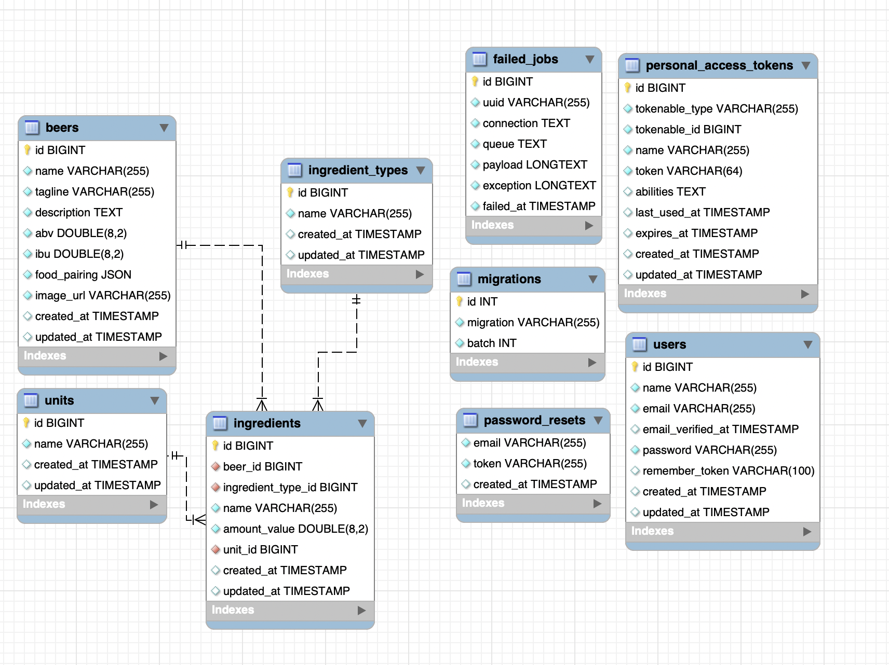

# Fullstack Application using laravel an vue

## Project Overview

The objective of this project is to develop a full-stack web application that seamlessly integrates Laravel (PHP) for the backend, MySQL for the database, and Vue.js for the frontend. The application will leverage the Punk Beer API to retrieve and display information about various beers, including their recommended food pairings. 

## Database Design Approach

The database design strategy selected is to utilize Laravel migrations, emphasizing a code-first approach. This entails defining the database structure through Laravel's migration which will generate the actual database schema. This approach aids in versioning the database management, facilitating seamless rollback processes when needed.

## Development Design Approach

My design methodology is a test Driven approach across the entire development process, from the Laravel backend to the front end, structured in a modular fashion. The process include:

1. **Backend Development:**
   - Laravel migrations for database schema setup
   - Model creation and associated fmodel actory for generating test data
   - Implementation of comprehensive tests to  ensure DB functionality

2. **Model Abstraction and Repository:**
   - I implemented an abstract class for Model Repositories
   - Development of based Model Repository by extending the abstract class for organized data access and extension of specific model repositories for uniques dataset access
   - Implementation of a REST Controller to manage interactions with DB components throught the provied repository interfacces

3. **External Interface and Service Implementation:**
   - Creatied an external interface to define integration signature for the external API
   - The interface defines the Fetch, Transform, and Process interfaces for its implementation.
   - Created a Concreted class to Implemente the interface to bridge the external interface with the REST controller application logic

4. **Asynchronous Processing and Caching:**
   - Created Jobs and Queues for efficient handling of background tasks to enhanced system performance when reading large datasets. 
   - Implementing caching using Laravel for search operations to improve application search experiences.

5. **Authentication and Validation Management:**
   - Authentication was implemented using Laravel Sanctum to provide API tokens to the frontend client
   - Data validation was extensively done during processing the external API data in the model, as well as in the transform process

6. **Exception and Validations:**
   - Exceptions were thrown, and a global exception handler was defined to handle any unhandled errors
   - Data validation was performed during:
     - Processing the external API data in the model
     - Transform process



##Application Setup
### Prerequisites:
1. Ensure you have [Composer](https://getcomposer.org/) installed.
2. Install [Node.js](https://nodejs.org/) and [npm](https://www.npmjs.com/).
3. Set up a database and configure your `.env` file with database credentials.

### Step-by-Step Guide:

#### 1. Clone the Repository:
```bash
git clone https://github.com/yourusername/your-repo.git
```

#### 2. Install Dependencies:
```bash
composer install
npm install
```

#### 3. Configure Environment:
```bash
cp .env.example .env
```

#### 4. Generate Application Key:
```bash
php artisan key:generate
```

#### 5. Run Migrations and Seed Database:
```bash
php artisan migrate --seed
```

#### 6. Compile Assets:
```bash
npm run dev
```
For production:
```bash
npm run production
```

#### 7. Serve the Application:
```bash
php artisan serve
```
The application should now be accessible at `http://localhost:8000`.

#### 8. Access the Vue SPA:
If your Vue SPA runs separately:
```bash
npm run serve
```


update your .env file with
APP_URL=http://localhost:port/ 
SANCTUM_STATEFUL_DOMAINS=localhost:port
SESSION_DOMAIN=localhost

where port is the port number of choice

Access the Vue SPA at `http://localhost:8080` (or the specified port).

